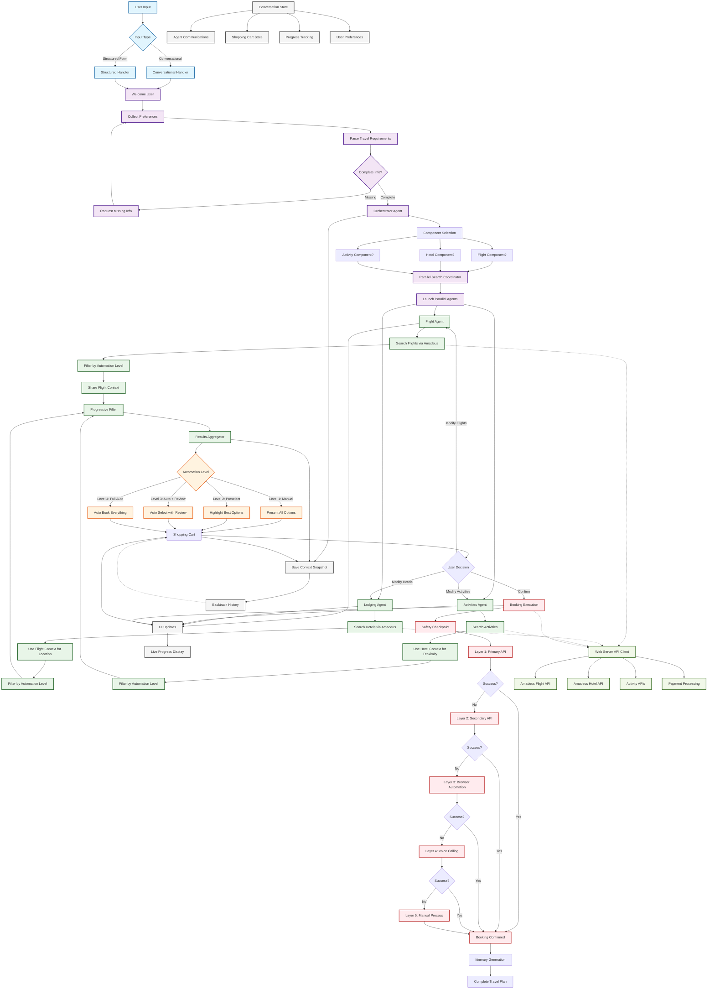

# TravelAgentic LangGraph Architecture

## Overview

This document describes the complete LangGraph architecture for TravelAgentic's AI-powered travel planning system. The architecture implements a single collaborative multi-agent orchestrator that handles conversational travel planning with real-time UI updates and automation levels 1-4.

> **📊 Visual Diagram Available:** 
> - **PNG Image**: [`langgraph_architecture_diagram.png`](langgraph_architecture_diagram.png) - High-resolution diagram (246KB)
> - **SVG Image**: [`langgraph_architecture_diagram.svg`](langgraph_architecture_diagram.svg) - Scalable vector image (117KB)
> - **Mermaid Source**: [`langgraph_architecture_diagram.mmd`](langgraph_architecture_diagram.mmd) - Editable diagram source

## Architecture Flow Diagram



## System Components

### 1. User Input Processing (Blue Components)

**Dual Input Support**
- **Conversational Input**: Natural language processing for requests like "Plan my Tokyo trip"
- **Structured Form Input**: Traditional form fields for destination, dates, budget, travelers

**Smart Parsing**
- Extracts travel requirements from natural language using LLM
- Validates completeness of travel requirements
- Generates follow-up questions for missing information

### 2. Orchestrator Coordination (Purple Components)

**Single Unified Graph**
- Replaces 4 separate LangGraph workflows with one collaborative system
- Coordinates all travel planning activities from input to final booking
- Maintains conversation context and progress tracking

**Component Selection Intelligence**
- Determines which travel components are needed (flights, hotels, activities)
- Handles cases where users don't need all components (e.g., local trips without flights)
- Adapts budget allocation based on selected components

### 3. Parallel Agent Execution (Green Components)

#### Flight Agent
- **Search**: Amadeus Flight API integration
- **Processing**: Filters results by automation level and user preferences
- **Context Sharing**: Provides arrival information to hotel agent

#### Lodging Agent  
- **Search**: Amadeus Hotel API integration
- **Context Awareness**: Uses flight arrival information for location optimization
- **Processing**: Prioritizes hotels with airport proximity when relevant

#### Activities Agent
- **Search**: Multiple activity APIs and mock data fallbacks
- **Context Awareness**: Uses hotel location for proximity recommendations
- **Processing**: Balances activity types and locations for optimal itinerary

### 4. Automation Level Routing (Orange Components)

The system supports 4 distinct automation levels:

#### Level 1: Manual Selection
- Present all available options (up to 5 per category)
- User makes final selections for each component
- Full control and transparency

#### Level 2: Preselected Options
- Highlight best options based on AI analysis
- Present 3-5 options with recommended choice marked
- User can confirm or change selections

#### Level 3: Auto-select with Review
- AI automatically selects best options
- Present complete plan for user review
- User confirms before booking proceeds

#### Level 4: Full Automation ("I'm Feeling Lucky")
- Complete AI autonomy in selection and booking
- Real-time progress updates
- Safety checkpoints for budget and unusual selections

### 5. Booking Execution (Red Components)

**5-Layer Fallback System** ensures booking reliability:

1. **Primary API**: Amadeus and partner booking APIs (fastest, most reliable)
2. **Secondary API**: Backup service providers for redundancy  
3. **Browser Automation**: Playwright-based web scraping when APIs fail
4. **Voice Calling**: Automated phone booking system (Level 3+ only)
5. **Manual Process**: Human intervention as final guarantee

**Safety Checkpoints**
- Budget validation before booking
- Unusual selection pattern detection
- User confirmation for high-value transactions

### 6. Smart Features (Gray Components)

#### Backtracking Support
- Context snapshots saved at key decision points
- Users can return to any previous state
- Conversation history preservation

#### Real-time UI Updates
- Live progress display during searches
- Streaming results as they become available
- Interactive cart management

#### State Management
- Comprehensive conversation state tracking
- Agent-to-agent communication logs
- Shopping cart versioning for rollback

## Technical Implementation

### LangGraph Structure

```python
# Main orchestrator graph structure
workflow = StateGraph(ConversationState)

# Core conversation nodes
workflow.add_node("welcome", self._welcome_user)
workflow.add_node("collect_preferences", self._collect_preferences)
workflow.add_node("orchestrator", self._orchestrator_agent)

# Parallel search coordination
workflow.add_node("parallel_search_coordinator", self._parallel_search_coordinator)
workflow.add_node("progressive_filter", self._progressive_filter)
workflow.add_node("results_aggregator", self._results_aggregator)

# Individual agents
workflow.add_node("flight_agent", self._flight_agent)
workflow.add_node("lodging_agent", self._lodging_agent)
workflow.add_node("activities_agent", self._activities_agent)

# Automation level routing
workflow.add_node("present_options", self._present_options)
workflow.add_node("preselect_options", self._preselect_options)
workflow.add_node("auto_select_with_review", self._auto_select_with_review)
workflow.add_node("auto_book", self._auto_book)

# Shopping cart and booking
workflow.add_node("shopping_cart", self._shopping_cart)
workflow.add_node("booking_execution", self._booking_execution)
workflow.add_node("itinerary_generation", self._itinerary_generation)
```

### State Management

```python
class ConversationState(TypedDict):
    # Core conversation
    conversation_id: str
    messages: List[Dict[str, Any]]
    current_step: str
    
    # User context
    user_preferences: Dict[str, Any]
    automation_level: int  # 1-4
    
    # Agent collaboration
    agent_communications: List[Dict[str, Any]]
    agent_status: Dict[str, str]
    agent_instructions: Dict[str, Any]
    
    # Shopping cart
    shopping_cart: Dict[str, Any]
    cart_version: int
    cart_dependencies: Dict[str, Any]
    
    # Backtracking
    backtrack_history: List[Dict[str, Any]]
    context_snapshots: Dict[str, Any]
    
    # UI updates
    ui_updates: List[Dict[str, Any]]
    progress: Dict[str, Any]
```

### API Integration

The system integrates with multiple external services:

- **Amadeus Travel APIs**: Flight and hotel search/booking
- **Activity APIs**: Local attractions and experiences
- **Payment Processing**: Stripe integration for secure transactions
- **Browser Automation**: Playwright for fallback booking scenarios

## User Experience Flow

### Typical User Journey

1. **Input**: User provides travel requirements via conversation or form
2. **Validation**: System validates and requests any missing information
3. **Component Selection**: System determines needed travel components
4. **Parallel Search**: Agents search flights, hotels, activities simultaneously
5. **Result Processing**: Results filtered and presented based on automation level
6. **Selection**: User reviews/confirms selections in shopping cart
7. **Booking**: System executes bookings with 5-layer fallback guarantee
8. **Completion**: Final itinerary generated and delivered

### Example Conversations

#### Level 1 (Manual)
```
User: "Plan a trip to Tokyo for 2 people, $3000 budget, March 15-22"
System: "I found 5 flight options. Please select your preferred flight:"
[Shows 5 detailed flight options]
User: [Selects option 3]
System: "Great! Now here are 5 hotel options near your arrival airport:"
[Process continues with user selecting each component]
```

#### Level 4 (Full Auto)
```
User: "Plan a trip to Tokyo for 2 people, $3000 budget, March 15-22"
System: "Building your perfect Tokyo trip... ✨"
[Real-time progress updates]
System: "Trip booked! Here's your complete itinerary:"
[Shows final confirmed bookings]
```

## Performance Optimizations

### Parallel Processing
- All agent searches run simultaneously
- Progressive filtering reduces processing time
- Results streaming for immediate user feedback

### Caching Strategy
- API response caching for repeated searches
- Context snapshot caching for backtracking
- User preference caching for faster personalization

### Error Handling
- Graceful degradation when APIs fail
- Automatic retry mechanisms
- Comprehensive fallback systems

## Security Considerations

### Data Protection
- User preferences encrypted in transit and at rest
- Payment information handled via secure tokenization
- Conversation history with configurable retention

### API Security
- Rate limiting on external API calls
- API key rotation and secure storage
- Request validation and sanitization

### Booking Security
- Transaction verification before processing
- Duplicate booking prevention
- Safety checkpoints for unusual patterns

## Monitoring and Analytics

### Performance Metrics
- Agent response times
- API success rates
- User satisfaction scores
- Booking completion rates

### Business Intelligence
- Popular destinations and preferences
- Automation level adoption
- Revenue attribution by component

## Future Enhancements

### Planned Features
- Voice interface integration
- Mobile app optimization
- Group travel coordination
- Corporate travel management

### AI Improvements
- Enhanced natural language understanding
- Predictive preference modeling
- Dynamic pricing optimization
- Personalized recommendation engines

---

*Last Updated: December 2024*
*Version: 1.0* 