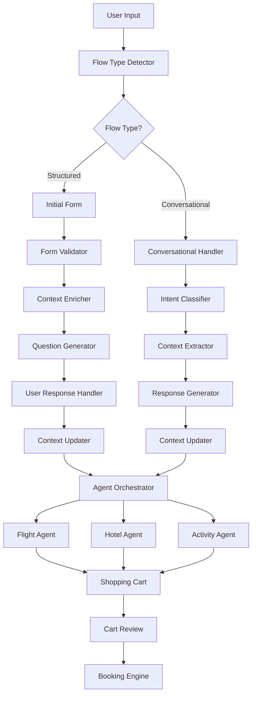
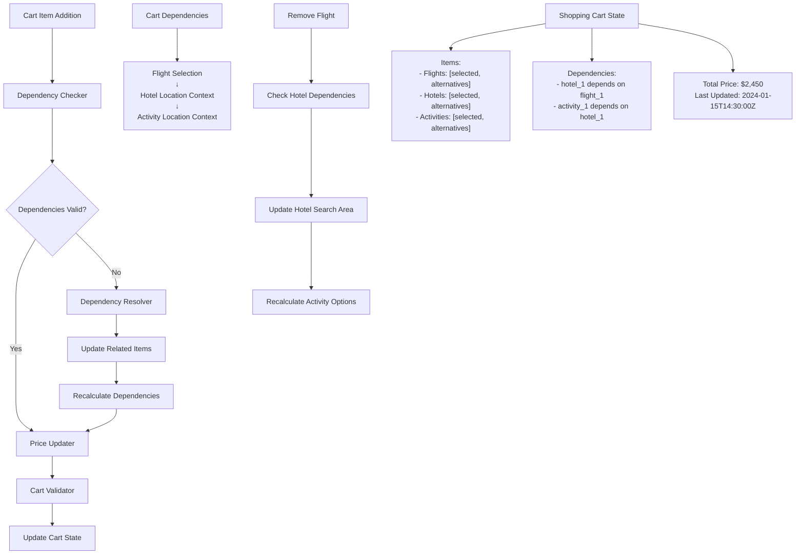
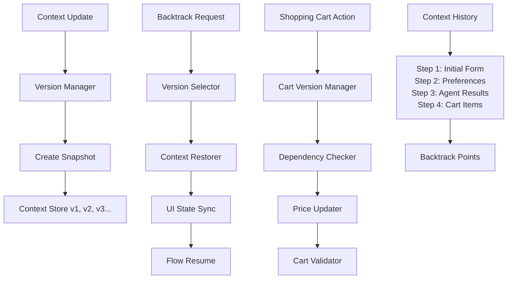
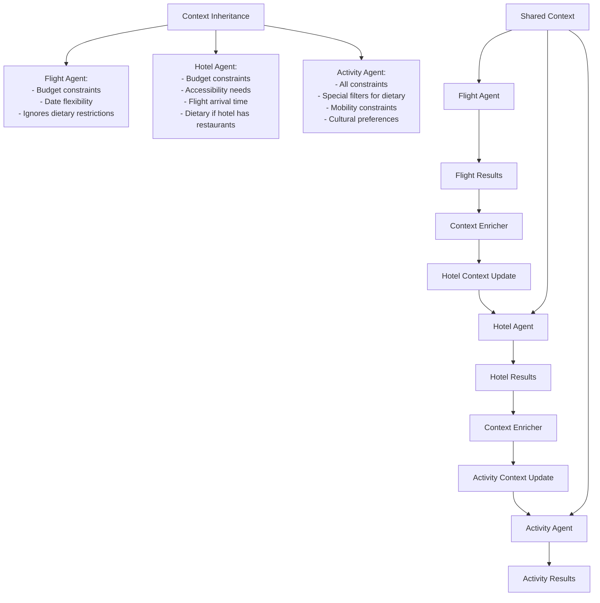
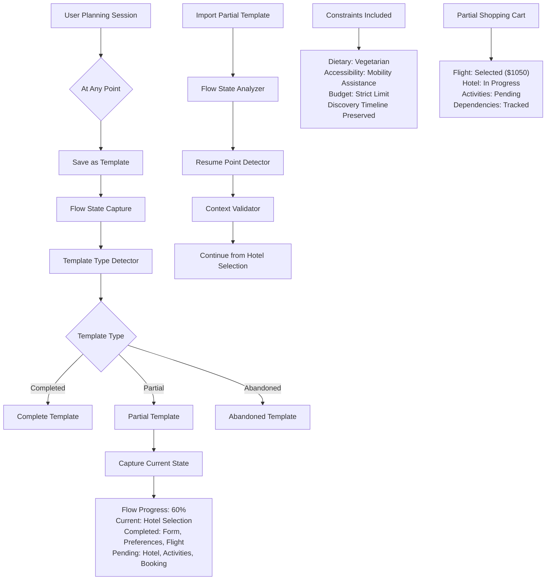
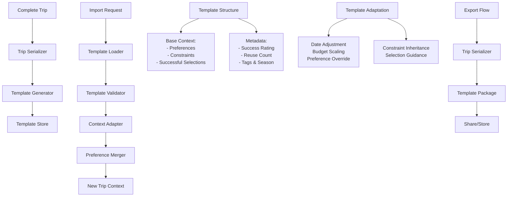
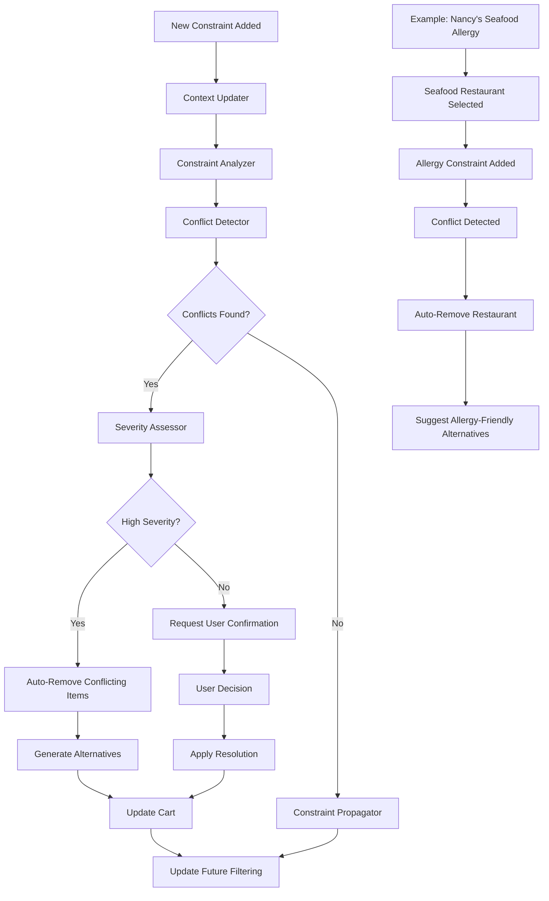

# TravelAgentic Langflow Architecture

## Core Design Principles

### Context Management as Foundation
- **Persistent Context Store**: Central state management throughout entire user journey
- **Versioned Context**: Enable backtracking by maintaining context snapshots
- **Context Inheritance**: Child agents inherit and update parent context
- **State Validation**: Ensure context integrity across all flow transitions

### Shopping Cart Experience
- **Item Management**: Add/remove/modify travel components (flights, hotels, activities)
- **Dynamic Pricing**: Real-time price updates and availability checking
- **Dependency Tracking**: Understand component relationships (flight → hotel location)
- **Cart Persistence**: Maintain selections during browsing and backtracking

## Flow Architecture

### 1. Entry Point Router
```
[User Input] → [Flow Type Detector] → [Structured Flow | Conversational Flow]
```

**Purpose**: Determine user journey type and initialize appropriate context structure

#### Overall Flow Architecture Diagram


**Context Initialization**:
```json
{
  "flow_type": "structured|conversational",
  "user_session": "session_id",
  "context_version": 1,
  "shopping_cart": {
    "flights": [],
    "hotels": [],
    "activities": [],
    "total_price": 0,
    "cart_version": 1
  },
  "backtrack_history": []
}
```

### 2. Structured Flow (User Story 1)

#### 2.1 Initial Form Processing
```
[Initial Form] → [Form Validator] → [Context Enricher] → [Question Generator]
```

**Nodes**:
- **Form Validator**: Validates starting_location, destination, dates
- **Context Enricher**: Adds destination insights, seasonal data, constraints
- **Question Generator**: Creates contextual multiple choice questions

#### 2.2 Preference Collection
```
[Generated Questions] → [User Response Handler] → [Context Updater] → [Completion Checker]
```

**Context Update Pattern**:
```json
{
  "context_version": 2,
  "preferences": {
    "destination": {"value": "Tokyo", "confidence": 0.95},
    "dates": {"departure": "2024-03-15", "flexibility": "±2 days"}
  },
  "backtrack_history": [
    {"step": "initial_form", "context_version": 1, "timestamp": "..."}
  ]
}
```

#### 2.3 Agent Orchestration
```
[Context Ready] → [Agent Dispatcher] → [Flight Agent | Hotel Agent | Activity Agent]
```

### 3. Conversational Flow (User Story 2)

#### 3.1 Conversational Context Extraction
```
[User Message] → [Intent Classifier] → [Context Extractor] → [Response Generator]
```

**Nodes**:
- **Intent Classifier**: Determines if user wants to add/modify/remove cart items
- **Context Extractor**: Pulls travel preferences from natural language
- **Response Generator**: Continues conversation or triggers agent search

#### 3.2 Auto-Selection Pipeline
```
[Context Complete] → [Agent Orchestrator] → [Auto-Selector] → [Cart Populator]
```

### 4. Shopping Cart Management System

#### 4.1 Cart State Manager
```
[Item Addition] → [Dependency Checker] → [Price Updater] → [Cart Validator]
```

**Cart Operations**:
- **Add Item**: Validate compatibility with existing selections
- **Remove Item**: Check dependencies and update related items
- **Modify Item**: Preserve context while updating selection
- **Price Update**: Real-time pricing with availability checking

#### Shopping Cart Management Flow


#### 4.2 Backtracking Engine
```
[Backtrack Request] → [Version Selector] → [Context Restorer] → [UI State Sync]
```

**Backtrack Capabilities**:
- **Step-by-step**: Go back one decision at a time
- **Component-level**: Return to specific component selection (flights, hotels)
- **Checkpoint**: Return to major milestones (preference collection, agent results)
- **Full reset**: Start over while preserving learned context

#### Context Management & Backtracking Flow


### 5. Agent Orchestration Layer

#### 5.1 Parallel Agent Execution
```
[Context] → [Flight Agent] → [Flight Results] → [Cart Integration]
           ↘ [Hotel Agent] → [Hotel Results] → [Cart Integration]
           ↘ [Activity Agent] → [Activity Results] → [Cart Integration]
```

#### 5.2 Sequential Recommendation Engine
```
[Flight Selection] → [Hotel Context Updater] → [Hotel Agent] → [Activity Context Updater] → [Activity Agent]
```

**Context Flow Between Agents**:
```json
{
  "flight_context": {
    "arrival_airport": "NRT",
    "arrival_time": "14:30",
    "departure_airport": "LAX"
  },
  "hotel_context": {
    "search_area": "near_NRT_or_city_center",
    "check_in": "2024-03-15",
    "influenced_by_flight": true
  }
}
```

#### Agent Orchestration & Context Inheritance


### 6. Specialized Agent Flows

#### 6.1 Flight Agent
```
[Flight Search] → [API Primary] → [Browser Fallback] → [Voice Fallback] → [Manual Input]
              ↘ [Result Ranker] → [Context Scorer] → [Recommendation Engine]
```

#### 6.2 Hotel Agent
```
[Hotel Search] → [Location Optimizer] → [API Search] → [Fallback Chain] → [Result Processor]
```

#### 6.3 Activity Agent
```
[Activity Search] → [Interest Matcher] → [Seasonal Filter] → [API Search] → [Curation Engine]
```

### 7. Booking Flow Management

#### 7.1 Pre-Booking Validation
```
[Cart Review] → [Availability Checker] → [Price Validator] → [Booking Orchestrator]
```

#### 7.2 Fallback Booking Engine
```
[Booking Request] → [API Booking] → [Browser Automation] → [Voice Calling] → [Manual Processing]
```

## Context Management Patterns

### 1. Context Versioning
```javascript
const contextManager = {
  current_version: 3,
  history: [
    {version: 1, step: "initial_form", context: {...}},
    {version: 2, step: "preference_collection", context: {...}},
    {version: 3, step: "agent_results", context: {...}}
  ],
  
  backtrack(target_version) {
    // Restore context and update UI state
  },
  
  snapshot(step_name) {
    // Save current context state
  }
}
```

### 2. Shopping Cart State
```javascript
const cartManager = {
  items: {
    flights: [{id: "flight_1", price: 500, selected: true}],
    hotels: [{id: "hotel_1", price: 150, selected: false}],
    activities: []
  },
  
  dependencies: {
    "hotel_1": ["flight_1"], // Hotel depends on flight selection
    "activity_1": ["hotel_1"] // Activity depends on hotel location
  },
  
  addItem(type, item) {
    // Add with dependency checking
  },
  
  removeItem(type, item_id) {
    // Remove and update dependencies
  }
}
```

### 3. Agent Context Inheritance
```javascript
const agentContext = {
  shared_context: {
    // Global trip context
    destination: "Tokyo",
    dates: {...},
    preferences: {...}
  },
  
  flight_context: {
    // Flight-specific context
    cabin_preference: "economy",
    timing_preference: "morning"
  },
  
  hotel_context: {
    // Hotel-specific context (inherits from flight results)
    proximity_to_airport: "medium",
    influenced_by_flight_arrival: true
  }
}
```

## Flow Transitions

### 1. Structured → Shopping Cart
```
[Preference Complete] → [Context Snapshot] → [Agent Dispatch] → [Results to Cart] → [Cart Review]
```

### 2. Conversational → Auto-Selection
```
[Context Extract] → [Agent Orchestration] → [Auto-Selection] → [Cart Population] → [User Review]
```

### 3. Backtracking Flows
```
[Backtrack Request] → [Version Selection] → [Context Restore] → [UI Sync] → [Flow Resume]
```

### 4. Template-Based Trip Creation
```
[Import Template] → [Template Adaptation] → [Context Merge] → [Agent Orchestration] → [Modified Trip]
```

### 8. Trip Template Management

#### 8.1 Trip Serialization Engine
```
[Complete Trip] → [Context Serializer] → [Template Generator] → [Template Store]
```

**Serialization Components**:
- **Complete Context**: All preferences, constraints, and user inputs
- **Shopping Cart State**: Selected items, alternatives, dependencies
- **Agent Results**: All search results and recommendations
- **Booking History**: Confirmation details and itinerary data

#### 8.2 Import/Export Flow
```
[Export Request] → [Trip Serializer] → [Template Package] → [Share/Store]
[Import Request] → [Template Loader] → [Context Deserializer] → [New Trip Base]
```

**Trip Template Structure**:
```json
{
  "template_id": "uuid",
  "template_name": "Nancy's Tokyo Adventure",
  "created_by": "user_id",
  "created_date": "2024-01-15T10:30:00Z",
  "template_version": "1.0",
  "template_type": "completed|partial|abandoned",
  "flow_state": {
    "current_step": "hotel_selection",
    "completed_steps": ["initial_form", "preference_collection", "flight_selection"],
    "pending_steps": ["hotel_selection", "activity_selection", "booking"],
    "flow_progress": 0.6,
    "last_interaction": "2024-01-15T14:30:00Z"
  },
  "base_context": {
    "preferences": {
      "destination": {"value": "Tokyo, Japan", "confidence": 0.95},
      "dates": {"departure": "2024-03-15", "return": "2024-03-22"},
      "budget": {"total": 3000, "currency": "USD"},
      "group": {"size": 2, "composition": "couple"},
      "constraints": [
        {"type": "dietary", "value": "vegetarian", "strictness": "required"},
        {"type": "accessibility", "value": "mobility_assistance", "applies_to": "companion"},
        {"type": "budget", "value": "strict_limit", "max_overage": 0.05}
      ],
      "context_confidence": 0.85,
      "preference_source": "form_based|conversational|mixed"
    },
    "selections": {
      "flights": {
        "status": "selected",
        "selection": {
          "template_selection": true,
          "airline": "JAL",
          "route": "LAX-NRT",
          "cabin": "economy",
          "price_range": [800, 1200],
          "selected_at": "2024-01-15T12:30:00Z"
        },
        "alternatives": [
          {"airline": "ANA", "price_range": [850, 1300]},
          {"airline": "United", "price_range": [780, 1150]}
        ]
      },
      "hotels": {
        "status": "in_progress",
        "agent_results": [
          {"type": "boutique", "location": "Shibuya", "price_range": [150, 200]},
          {"type": "business", "location": "Shinjuku", "price_range": [120, 180]}
        ],
        "user_feedback": "Prefers boutique style, wants central location",
        "last_search": "2024-01-15T14:00:00Z"
      },
      "activities": {
        "status": "pending",
        "agent_triggered": false,
        "context_ready": true
      }
    },
    "shopping_cart": {
      "items": [
        {
          "type": "flight",
          "id": "flight_jal_123",
          "selected": true,
          "price": 1050,
          "dependencies": []
        }
      ],
      "total_price": 1050,
      "partial_total": true,
      "price_alerts": ["hotel_budget_remaining: $1950"]
    },
    "constraint_history": [
      {
        "constraint": "vegetarian",
        "discovered_at": "preference_collection",
        "conflicts_resolved": 0,
        "impact_scope": ["activities", "hotels_with_restaurants"]
      },
      {
        "constraint": "mobility_assistance",
        "discovered_at": "flight_selection",
        "conflicts_resolved": 1,
        "auto_actions": ["filtered_hotels_for_accessibility"]
      }
    ]
  },
  "template_metadata": {
    "completion_status": "partial",
    "trip_success_rating": null,
    "estimated_completion_time": "15_minutes",
    "reuse_count": 0,
    "tags": ["cultural", "food-safe", "accessibility-needed", "in-progress"],
    "season": "spring",
    "privacy_level": "private",
    "resumable": true,
    "share_partial": true
  }
}
```

#### 8.3 Template-Based Trip Creation
```
[Import Template] → [Template Validator] → [Context Adapter] → [Preference Merger] → [New Trip Context]
```

**Template Adaptation Process**:
- **Date Adjustment**: Update dates while preserving seasonal context
- **Budget Scaling**: Adjust budget based on current prices
- **Preference Override**: Allow user to modify template preferences
- **Constraint Inheritance**: Carry over all constraints with conflict detection
- **Selection Guidance**: Use template selections as starting recommendations
- **Flow State Resume**: Continue from where template left off
- **Partial Completion**: Handle templates with incomplete selections
- **Context Confidence**: Adjust recommendations based on template confidence levels

#### 8.4 Partial Flow Resumption
```
[Partial Template] → [Flow State Analyzer] → [Context Validator] → [Resume Point Detector] → [Continued Flow]
```

**Partial Flow Handling**:
- **State Reconstruction**: Rebuild exact flow position from template
- **Context Validation**: Ensure all constraints are still valid
- **Agent State Resume**: Continue agent searches from where they left off
- **Cart State Restoration**: Restore partial shopping cart with dependencies
- **Conflict Resolution**: Handle constraint changes since template creation

#### 8.5 Trip Template Versioning
```
[Template Update] → [Version Manager] → [Template Archive] → [New Version]
```

**Version Management**:
- **Template Evolution**: Track improvements and modifications
- **Success Metrics**: Monitor template reuse success rates for both partial and complete templates
- **Rollback Capability**: Revert to previous template versions
- **Merge Conflicts**: Handle conflicting template updates
- **Partial Progression**: Track how partial templates progress to completion

#### Partial Flow & Constraint Management


#### Trip Template Import/Export Flow


## Implementation Strategy

### 1. Context Storage
- **Primary**: Redis for session management
- **Backup**: Database for persistence
- **Versioning**: JSON patches for efficient storage
- **Templates**: Separate template database for long-term storage

### 2. Agent Communication
- **Message Queue**: RabbitMQ for agent coordination
- **Context Sharing**: Shared Redis namespace
- **Result Aggregation**: Centralized result collector

### 3. Shopping Cart Persistence
- **Real-time Updates**: WebSocket for live cart updates
- **Conflict Resolution**: Optimistic locking for concurrent modifications
- **Price Monitoring**: Background jobs for price change detection

### 4. Backtracking Implementation
- **Checkpoint System**: Strategic save points in user journey
- **Lazy Loading**: Load context versions on demand
- **State Reconstruction**: Rebuild UI state from context snapshots

### 5. Trip Template Storage
- **Template Database**: PostgreSQL for structured template storage
- **Template Search**: Elasticsearch for template discovery
- **Template Sharing**: S3 for template export/import files
- **Template Caching**: Redis for frequently accessed templates

## Flow Monitoring & Debugging

### 1. Context Auditing
- **Version Tracking**: Log all context changes
- **Decision Points**: Track user choices and agent recommendations
- **Performance Metrics**: Context size and processing time

### 2. Cart Analytics
- **Conversion Tracking**: Monitor cart completion rates
- **Abandonment Analysis**: Identify drop-off points
- **Backtrack Patterns**: Understand user backtracking behavior

## Context Conflict Detection & Real-time Updates

### Conflict Detection Engine
```
[Context Update] → [Constraint Analyzer] → [Conflict Detector] → [Resolution Engine]
```

**Purpose**: Automatically detect when new context contradicts existing selections and proactively suggest corrections.

#### Conflict Detection & Resolution Flow


### Real-time Constraint Propagation

#### Scenario: Nancy's Seafood Allergy Discovery
```json
{
  "context_update": {
    "new_constraint": {
      "type": "dietary_restriction",
      "value": "seafood_allergy",
      "applies_to": "nephew",
      "strictness": "required",
      "confidence": 1.0,
      "source": "user_stated",
      "timestamp": "2024-01-15T14:30:00Z"
    }
  },
  "conflict_detection": {
    "existing_selections": [
      {
        "id": "restaurant_1",
        "type": "activity",
        "category": "seafood_restaurant",
        "conflicts_with": ["seafood_allergy"],
        "conflict_severity": "high"
      }
    ],
    "auto_actions": [
      {
        "action": "remove_selection",
        "item_id": "restaurant_1",
        "reason": "conflicts_with_new_constraint"
      },
      {
        "action": "generate_alternatives",
        "category": "restaurants",
        "filters": ["no_seafood", "allergy_friendly"]
      }
    ]
  }
}
```

### Enhanced Context Update Flow

#### 4.3 Constraint Impact Analyzer
```
[New Constraint] → [Impact Analyzer] → [Conflict Detector] → [Resolution Orchestrator]
```

**Nodes**:
- **Impact Analyzer**: Scans all existing selections for potential conflicts
- **Conflict Detector**: Identifies specific conflicts and severity levels
- **Resolution Orchestrator**: Determines automatic actions vs user confirmation needed

#### 4.4 Proactive Correction Engine
```
[Conflict Detected] → [Severity Assessor] → [Auto-Fix | User Confirmation] → [Cart Updater]
```

**Resolution Strategies**:
- **Auto-Remove**: High confidence conflicts (seafood allergy vs seafood restaurant)
- **User Confirmation**: Ambiguous conflicts (budget increase vs upgrade)
- **Alternative Generation**: Automatically suggest replacements
- **Context Propagation**: Update all future recommendations with new constraints

### Context Memory & Learning

#### Enhanced Context Structure
```json
{
  "constraints": {
    "dietary_restrictions": [
      {
        "type": "seafood_allergy",
        "applies_to": "nephew",
        "discovered_at": "activity_selection",
        "impact_level": "high",
        "propagation_scope": "all_food_recommendations"
      }
    ]
  },
  "constraint_history": [
    {
      "constraint": "seafood_allergy",
      "added_at": "2024-01-15T14:30:00Z",
      "triggered_conflicts": ["restaurant_1"],
      "auto_resolutions": ["removed_restaurant_1", "filtered_future_recommendations"]
    }
  ]
}
```

#### LLM Context Awareness
```javascript
const constraintAwareRecommendation = {
  // When generating any food-related recommendations
  filteringRules: [
    {
      constraint: "seafood_allergy",
      scope: "all_food_venues",
      action: "exclude_seafood_options",
      confidence: 1.0
    }
  ],
  
  // LLM prompt enhancement
  systemPrompt: `
    CRITICAL CONSTRAINTS:
    - Nephew has seafood allergy - NEVER recommend seafood restaurants/activities
    - Apply this constraint to ALL food recommendations throughout the trip
    - If user previously selected seafood options, flag for removal
  `
}
```

### Real-time Context Updates

#### Before Flight Selection (Scenario 2)
```
[Allergy Mention] → [Context Updater] → [Constraint Propagator] → [Future Filtering]
```

**Result**: All subsequent recommendations automatically filtered

#### After Activity Selection (Scenario 1)
```
[Allergy Mention] → [Context Updater] → [Conflict Detector] → [Proactive Correction]
```

**Result**: Existing seafood restaurant flagged for removal + alternatives suggested

### Implementation Enhancements

#### 5.3 Context Conflict Detection Layer
```
[Context Update] → [Existing Selection Scanner] → [Conflict Matrix] → [Resolution Engine]
```

**Conflict Matrix Examples**:
- Seafood allergy + Seafood restaurant = Auto-remove
- Budget constraint + Expensive hotel = User confirmation
- Mobility issues + Walking tours = Suggest alternatives

#### 5.4 Proactive LLM Integration
```javascript
const contextAwareLLM = {
  beforeRecommendation: (context) => {
    // Check all constraints before making recommendations
    const activeConstraints = context.constraints;
    const filteringRules = generateFilteringRules(activeConstraints);
    return applyFilters(recommendations, filteringRules);
  },
  
  afterContextUpdate: (newConstraint, existingSelections) => {
    // Check for conflicts and suggest corrections
    const conflicts = detectConflicts(newConstraint, existingSelections);
    if (conflicts.length > 0) {
      return generateResolutionSuggestions(conflicts);
    }
  }
}
```

## Context Memory Patterns

### 1. Constraint Inheritance
```javascript
const constraintPropagation = {
  // All food-related agents inherit dietary restrictions
  flightAgent: {
    inherits: ["budget_constraints", "date_flexibility"],
    ignores: ["dietary_restrictions"] // Not relevant to flights
  },
  
  activityAgent: {
    inherits: ["all_constraints"], // All constraints relevant
    specialFilters: ["dietary_restrictions", "mobility_constraints"]
  },
  
  hotelAgent: {
    inherits: ["budget_constraints", "accessibility_needs"],
    ignores: ["dietary_restrictions"] // Unless hotel has restaurants
  }
}
```

### 2. Temporal Context Awareness
```javascript
const contextTimeline = {
  // LLM knows when constraints were discovered
  "seafood_allergy": {
    discovered_at: "post_activity_selection",
    requires_retroactive_checking: true,
    affected_components: ["restaurants", "food_tours", "cooking_classes"]
  }
}
```

### 3. Template Context Integration
```javascript
const templateContextManager = {
  // Merging template context with current user input
  mergeTemplateContext(templateContext, userInput) {
    const mergedContext = {
      base_preferences: templateContext.preferences,
      user_overrides: userInput.preferences,
      inherited_constraints: templateContext.constraints,
      template_selections: templateContext.selections,
      flow_state: templateContext.flow_state,
      partial_cart: templateContext.shopping_cart,
      constraint_history: templateContext.constraint_history,
      adaptation_rules: {
        date_adjustment: "preserve_seasonal_context",
        budget_scaling: "adjust_for_current_prices",
        preference_priority: "user_override_wins",
        constraint_inheritance: "all_constraints_preserved",
        flow_resumption: "continue_from_template_state"
      }
    };
    
    return this.resolveConflicts(mergedContext);
  },
  
  // Resume partial flow from template
  resumePartialFlow(template, userUpdates) {
    const flowResumer = {
      current_step: template.flow_state.current_step,
      completed_context: template.flow_state.completed_steps,
      partial_selections: template.selections,
      shopping_cart: template.shopping_cart,
      constraints: template.constraints,
      
      // Apply any user updates while preserving flow state
      mergeUpdates: (updates) => {
        return {
          ...template.base_context,
          ...updates,
          constraints: this.mergeConstraints(template.constraints, updates.constraints),
          flow_position: template.flow_state.current_step
        };
      }
    };
    
    return flowResumer.mergeUpdates(userUpdates);
  },
  
  // Creating template from any point in flow (complete or partial)
  createTemplate(tripContext, userMetadata, flowState) {
    return {
      template_id: generateUUID(),
      template_name: userMetadata.name,
      template_type: flowState.completion_status,
      flow_state: {
        current_step: flowState.current_step,
        completed_steps: flowState.completed_steps,
        flow_progress: flowState.progress_percentage,
        last_interaction: new Date().toISOString()
      },
      base_context: {
        preferences: tripContext.preferences,
        constraints: tripContext.constraints,
        selections: tripContext.selections,
        shopping_cart: tripContext.shopping_cart,
        constraint_history: tripContext.constraint_history
      },
      template_metadata: {
        completion_status: flowState.completion_status,
        success_rating: tripContext.user_satisfaction || null,
        estimated_completion_time: flowState.estimated_time_remaining,
        reuse_count: 0,
        tags: this.generateTags(tripContext),
        season: this.extractSeason(tripContext.dates),
        resumable: flowState.completion_status !== "completed",
        share_partial: userMetadata.allow_partial_sharing
      }
    };
  }
}
```

This enhancement ensures that the LLM has full memory of constraints and can proactively manage conflicts, regardless of when the information is discovered in the user journey. 